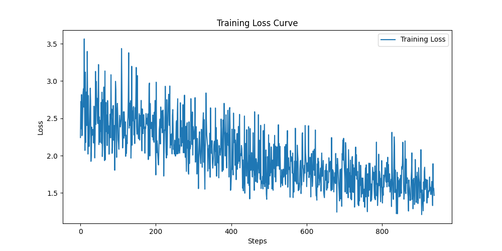
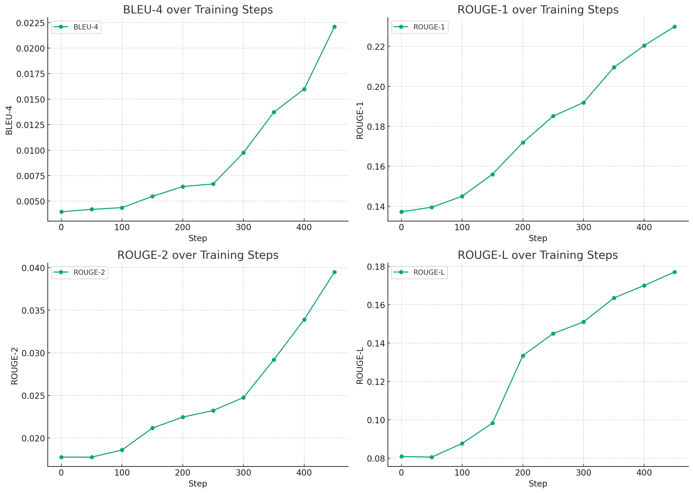

# ChatGLM-LoRA for Insomnia Psychotherapy Project

本项目专注于为失眠患者提供心理治疗服务，通过LoRA (Low-Rank Adaptation) 技术对ChatGLM-6b模型进行微调，并进行临床试验证明了其在技术上的可行性与临床应用的潜力。

数据集包含5000条与睡眠障碍相关的对话，分为训练集、验证集和测试集，确保模型的准确性和可靠性。

本项目在为失眠患者提供有效心理治疗方案方面展示出创新成果，标志着使用先进语言模型辅助心理治疗在医疗健康领域的一大步。

## 环境需求

- Python 3.x
- torch==2.1.1+cu118
- transformers==4.28.1
- peft==0.3.0
- deepspeed==0.9.2
- icetk
- mpi4py
- accelerate
- cpm_kernels
- sentencepiece==0.1.99

## 安装指南

确保您已经安装了上述所需库。如果没有安装，可以通过以下命令安装：

```bash
pip install -r requirements.txt
```

## 使用说明

### 1、数据准备

**步骤1：放置数据集**

将原始数据集放置在项目目录下的`data/preprocess`文件夹中。确保你的文件结构如下所示：

```bash
your-project/
├── data/
    └── preprocess/
```

**步骤2：预处理数据集**

使用下列脚本对数据集进行预处理：

- 修改标签

```python
python modify_labels.py
```

- 转换数据格式

```python
python data_conversion_format.py
```

- 修改instruct字段的内容

```python
python modify_data_content.py
```

- 分割数据集

```python
python split_dataset.py
```

**步骤3：保存预处理后的数据集**

执行上述脚本后，数据集将被处理并保存在 `data` 目录中。确保预处理后的数据存储结构如下：

```bash
your-project/
├── data/ # 预处理后的数据集位置
```

### 2、模型训练

使用以下脚本进行训练：

```python
deepspeed train_deepspeed.py
```

### 3、模型评估

**BLEU和ROUGE评估**

执行BLEU和ROUGE评估脚本：

```python
python evaluation.py
```

**C-Eval评估**

执行C-Eval评估命令：

```bash
bash ceval/cli.sh
```

### 4、本地部署

使用以下脚本将微调模型部署到本地：

```python
python chat.py
```

## 模型指标

### 损失曲线



### 评估结果



## 引用
> https://github.com/taishan1994/ChatGLM-LoRA-Tuning
> 
> https://github.com/hkust-nlp/ceval
> 
> https://juejin.cn/post/7249626243125231677
